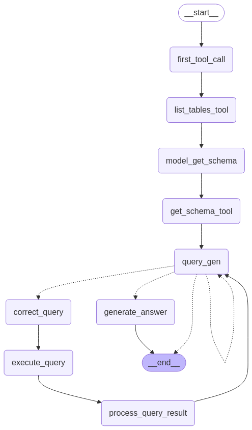

# MeokTen (먹텐)

## 프로젝트 소개
성시경의 유튜브 채널 '먹을텐데' 플레이리스트를 기반으로 한 맛집 추천 서비스입니다. 유튜브 영상에서 소개된 맛집 정보를 수집하고 분석하여 사용자에게 맞춤형 맛집 추천을 제공합니다.

## 주요 기능
- **데이터 자동 수집**: yt_dlp를 활용하여 '먹을텐데' 플레이리스트의 영상 정보 및 자막을 수집
- **메뉴 정보 추출**: LLM을 활용하여 영상 자막에서 메뉴 정보, 리뷰 내용을 자동으로 추출
- **좌표 및 지하철정보 수집**: 수집된 주소를 기반으로 좌표와 인근 지하철 정보 수집
- **에이전트 검색**: SQL Agent와 LangGraph를 기반으로 지역, 메뉴 타입 등 다양한 조건으로 맛집 검색 가능
- **지도 시각화**: Folium 라이브러리를 활용하여 검색된 맛집을 지도상에 표시

## 에이전트 워크플로우
아래 다이어그램은 맛집 추천 에이전트의 작동 흐름을 보여줍니다:



## 기술 스택
- **프론트엔드**: Streamlit
- **백엔드**: Python, SQLite
- **데이터 수집**: yt_dlp, KAKAO API
- **지도 시각화**: Folium, Streamlit-Folium
- **AI/ML**: LangChain, LangGraph, OpenAI API
- **로깅**: Python logging 모듈

## 데이터베이스 구조
- **restaurants**: 식당 기본 정보 (이름, 주소, 위도/경도, 영상 ID, URL)
- **menus**: 각 식당의 메뉴 정보 (메뉴 타입, 메뉴명, 리뷰)

## 설치 및 실행 방법
1. 저장소 클론
   ```bash
   git clone https://github.com/yourusername/meokten.git
   cd meokten
   ```

2. 필요 패키지 설치
   ```bash
   pip install -r requirements.txt
   ```

3. 환경 변수 설정
   ```bash
   # .env 파일 생성
   OPENAI_API_KEY=your_openai_api_key
   KAKAO_API_KEY=your_kakao_api_key
   ```

4. 데이터 수집 실행 (cronjob 적용 가능한 환경에서는 적용해서 사용)
   ```bash
   cd data_collect
   python colleting_data.py
   python save_db.py
   ```

5. 서비스 실행
   ```bash
   streamlit run meokten.py
   ```

## 프로젝트 구조
```
meokten/
├── meokten.py           # 메인 Streamlit 애플리케이션
├── meokten.db           # SQLite 데이터베이스
├── .env                 # 환경 변수
├── requirements.txt     # 의존성 패키지
├── graph_workflow.png   # 에이전트 워크플로우 다이어그램
│
├── agent/               # 에이전트 관련 모듈
│   ├── config.py        # 설정 및 로깅
│   ├── db.py            # 데이터베이스 연결 (ps. streamlit cloud 환경 사용 목적으로 db를 url로 불러와 사용)
│   ├── graph.py         # LangGraph 기반 에이전트
│   ├── prompt_chains.py # 프롬프트 템플릿
│   └── tools.py         # 커스텀 도구
│
├── utils/               # 유틸리티 함수
│   └── map_utils.py     # 지도 시각화 유틸리티
│
├── data_collect/        # 데이터 수집 관련 모듈
│   ├── colleting_data.py           # 유튜브 데이터 수집
│   ├── save_db.py                  # 데이터베이스 저장
│   └── meokten_restaurants.json    # 수집된 맛집 데이터
│
└── logs/                # 로그 파일
```

## 데이터 수집 과정
1. YouTube 플레이리스트에서 영상 정보 추출
2. 각 영상의 설명에서 식당명과 주소 추출
3. KAKAO API를 통해 주소의 위도/경도 및 인근 지하철역 정보 획득
4. YouTube 자막 혹은 자동생성 자막을 통해 영상 자막 추출(whipser를 사용하여 음성 추출도 가능하겠으나, 먹을텐데 플레이리스트는 자막이 제공이 잘 되어 굳이 필요하지 않음.)
5. openai(GPT-4o를) 활용하여 자막에서 메뉴 정보 및 리뷰 추출
6. 추출된 정보를 구조화하여 데이터베이스에 저장

## 에이전트 아키텍처
프로젝트는 LangGraph를 기반으로 한 에이전트 아키텍처를 사용합니다:
1. 사용자 질의 접수
2. 데이터베이스 스키마 파악
3. 적절한 SQL 쿼리 생성(모든 정보를 사용하므로 table join 및 모든 컬럼을 조회하도록 지시함)
4. 쿼리 실행 및 결과 처리
5. 사용자에게 맞춤형 응답 생성

## 향후 계획
- Tavily Search 통합으로 실시간 웹 검색 결과 제공

---

*이 프로젝트는 성시경의 '먹을텐데' 콘텐츠를 기반으로 하며, 모든 저작권은 원 저작자에게 있습니다.*
